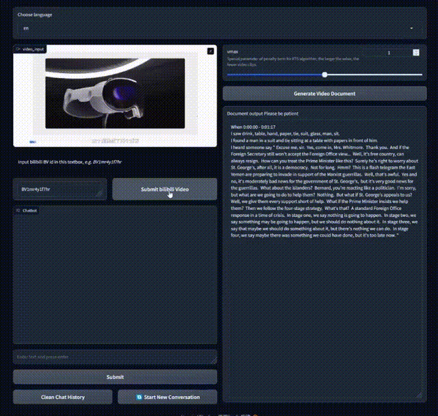
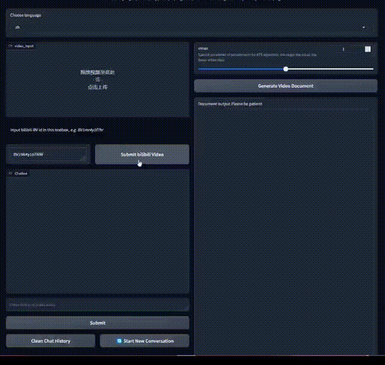

# 🤖 VChat-BigDL: A ChatBot for Video Understanding Based on BigDL

Powered by BigDL, ChatGLM3, LLaMA, Clip, Whisper, Tag2Text, multilingual-e5-large, LangChain and inspired by showlab/Vlog, we turn a video into a long document which records visual and audio information. Then we can chat over the record only using Intel CPU.

## News

- 2023.11.16 We replaced LLaMA with **ChatGLM3-6b-32k**. And we use a multilingual sentence embedding model "**multilingual-e5-large**". Now VChat has native Chinese Q & A capabilities

## Pipeline


## Demo

|[English](data/demo/demo2.mp4)|[Chinese](data/demo/demo1.mp4)|
|:-:|:-:|
|||
|||

## Environment Preparing

### System ---Windows

#### 1. Create Conda Environment

```bash
conda create -n vchat python=3.9 -y
conda activate vchat
cd VChat-BigDL
pip install -U -r requirements.txt
```
#### 2. Install FFmpeg

```bash
conda install -c conda-forge ffmpeg -y
```

#### 3. Download Model Weight

##### Download Clip, Llama, Helsinki, all-MiniLM-L12-v2 by huggingface

```bash
python download_ckpt.py
```

##### Download Tag2Text weight from [here](https://huggingface.co/spaces/xinyu1205/recognize-anything/blob/main/tag2text_swin_14m.pth)

**✅Please save weights to ./checkpoints.**

#### 4. Optimaize Models

```bash
python model_low_bit_optimize.py
```

#### 5. Run with Gradio
```bash
python main_gradio.py
```

## Tutorial
You can find the tutorial of VChat [here](TUTORIAL.md).

## ❗Attention❗

#### 1. Gradio Warning

```bash
Could not create share link. Missing file: D:\anaconda3\envs\vchat\lib\site-packages\gradio\frpc_windows_amd64_v0.2.
```

Please check your internet connection. This can happen if your antivirus software blocks the download of this file. You can install manually by following these steps:

1. Download this file: https://cdn-media.huggingface.co/frpc-gradio-0.2/frpc_linux_amd64
2. Rename the downloaded file to: frpc_linux_amd64_v0.2
3. Move the file to this location: .\anaconda3\envs\vchat\lib\site-packages\gradio.
4. Give this file executable permissions (For Linux users)
```bash
chmod +x frpc_linux_amd64_v0.2
```

#### 2. One by One

Multiple people using the same demo at the same time will cause an error because the asynchronous running logic is not implemented.


## Acknowledge

This project is based on [BigDL](https://github.com/intel-analytics/BigDL), [Vlog](https://github.com/showlab/VLog/tree/main), [Tag2Text](https://tag2text.github.io/), [Whisper](https://github.com/openai/whisper), [ChatGLM3](https://github.com/THUDM/ChatGLM3), [LLaMA](https://github.com/facebookresearch/llama), [multilingual-e5-large](https://huggingface.co/intfloat/multilingual-e5-large), [KTS](https://inria.hal.science/hal-01022967/PDF/video_summarization.pdf), [LangChain](https://python.langchain.com/en/latest/), [Douyin_Tiktok_Scraper_PyPi](https://github.com/Evil0ctal/Douyin_Tiktok_Scraper_PyPi).