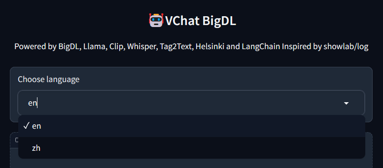
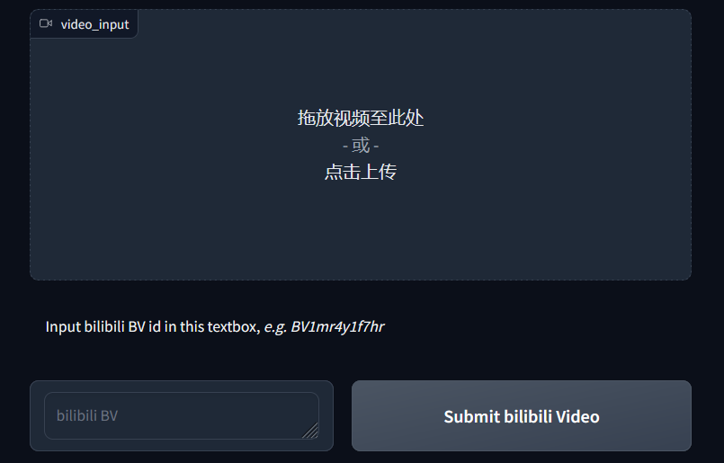
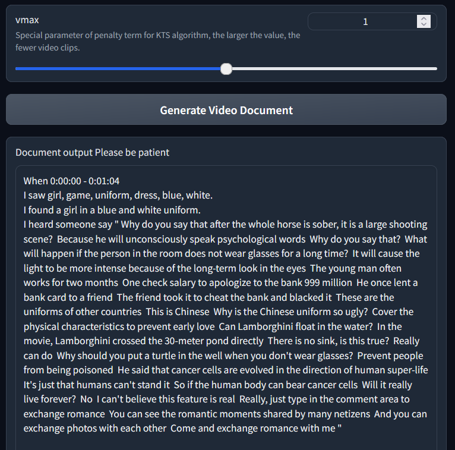
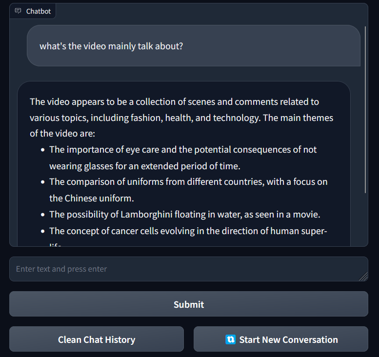

# How to Use 🤖VChat-BigDL

## STEP1 Open the Given URL in Local Browser

## STEP2 Select a Language
    

1.  If you select **'en'** the subsequent answers will be in English.
2.  if you select **'zh'** they will be in Chinese.

## STEP3 Input Video

**you can input the video in two ways**

1. ***You have a downloaded video***:

    Drag the local video into the **Video Input box** or **click the Video Input box** to upload your local vedio.

2. ***You don't have a local vedio***:
    Input **bilibili BV id** in the textbox and click **Submit bilibili Video button**.

## STEP4 Analyze the Video

Click the **Generate Video Document button** and wait for the analysis to complete.

✅You can change the **vmax** parameter if you want to change the number of cilps.

## STEP5 Talk with Chatbot

You can chat with chatbot, ask it some questions about the given video.

1.  Click **Submit button**  to submit a question.
2.  Click **Clean Chat History button** to clear chat history.
3.  Click **Start New Conversation button** to renew the how page and chat with another video.
